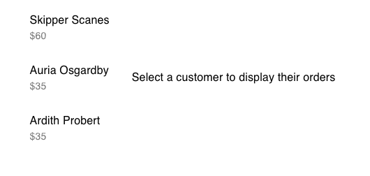

# fauna-test

## Assumptions
  * The front end component(s) will be embedded in some other page at some point
  * Styling/design will be provided later

## Dependencies
 * [js-yaml](https://github.com/nodeca/js-yaml) to parse YAML files and apply custom tags
 * [csv-parse](https://github.com/adaltas/node-csv-parse) to parse CSV files
 * [stream-transform](https://github.com/adaltas/node-stream-transform) an extension of [Transform](https://nodejs.org/api/stream.html#stream_class_stream_transform) used for ease and readability when transforming data in a stream

## Setup, Demonstration, Testing

### Dependencies
The project depends on Node.js and NPM. You can find out more about how to install those [here](https://www.npmjs.com/get-npm). Once that's taken care of, ideally, all project dependencies should be installed by running the following command:
```bash
npm install
```

### Local testing
This will install dependencies for both frontend and backend projects. Once that's done, it's best to run these two commands in separate terminals/tabs, so you can see output for each
```
npm run start-backend
npm run start-frontend
```

Once they've completed, you should be able to access the backend `order-summary` endpoint [here](http://localhost:8080/fauna-test-backend/order-summary). If the frontend didn't start up and show something in your browser, you can find that page [here](http://localhost:3000/). You should see something like this:


### Unit testing
Similarly, these two commands will execute unit tests for each project:
```
npm run test-backend
npm run test-frontend
```

## Decisions/Thought Process
### Backend
I built the backend with the intention of deploying it to AWS in a lambda. It's what I'm used to these days and that's the lowest (personal) effort for me to get it deployed and viewable somewhere. That's why there are a couple of extra files and some dependencies on AWS libraries.

I built it first so I could use it for testing. That's why there are some extra endpoints to retrieve raw customer, order, and product data as well as Handler classes to handle calls to those endpoints.

I tried to build interfaces (really just abstract classes, so I could be more strict with their properties) mostly to show that I knew how, but also to make switching to some other DB (or switching to GraphQL) as easy as writing a new extension of `StorageUtil`.

I modeled most of the data at rest, but balked at fully modeling all response types when I saw the complicated `@ref` attributes. It would be nice to have those, but it would be REALLY nice if the faunadb sdk could type the shape of its return values with something a little better than `object`.

I sank a decent amount of time into trying to figure out if a query could resolve all references instead of storing them in `@ref` fields. I didn't find anything before I decided to cut bait and make separate calls to resolve all references.

### Frontend
I'm not so great at making full pages that look sharp, so I stuck the two frontend Assumptions at the top of this README. I feel like that's a pretty valid assumption, as functionality this small is likely to be embedded in some larger page and would probably need to be restyled to fit its look.

I tried to keep things as modular as possible without going overboard. `LineItemTable` could probably use its own file, but sticking it at the top of `OrderSummaryCard` seemed to make more sense at the time.

## Next Steps
  * Add test coverage to both projects
  * Deploy it to AWS to show it works
  * Figure out if there's a way to resolve references on the Fauna DB side instead of the client side, to reduce the number of queries made
  * Enhance models to match retrieval of data, do one of these:
    * add possibility that a field is actually a reference)
    * enhance retrieval to resolve *all* references and match models
  * Did I miss entity ID somewhere? those would've been nice to have on the frontend when displaying orders
  * Filters/sorting on the customer list would be nice, but definitely out of scope